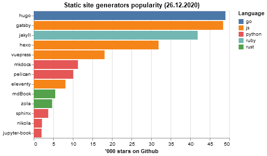

# Popularity of static site generators

Static site generators are tools to create blogs, landing pages and documentation.

|                                                                  |   '000 stars | Language   |
|------------------------------------------------------------------|--------------|------------|
| [hugo](https://github.com/gohugoio/hugo/)                        |         49.0 | go         |
| [gatsby](https://github.com/gatsbyjs/gatsby/)                    |         48.4 | js         |
| [jekyll](https://github.com/jekyll/jekyll/)                      |         41.9 | ruby       |
| [hexo](https://github.com/hexojs/hexo/)                          |         31.9 | js         |
| [vuepress](https://github.com/vuejs/vuepress/)                   |         18.1 | js         |
| [mkdocs](https://github.com/mkdocs/mkdocs/)                      |         11.3 | python     |
| [pelican](https://github.com/getpelican/pelican/)                |         10.1 | python     |
| [eleventy](https://github.com/11ty/eleventy/)                    |          8.1 | js         |
| [mdBook](https://github.com/rust-lang/mdBook/)                   |          5.5 | rust       |
| [zola](https://github.com/getzola/zola/)                         |          4.7 | rust       |
| [sphinx](https://github.com/sphinx-doc/sphinx/)                  |          3.7 | python     |
| [nikola](https://github.com/getnikola/nikola/)                   |          2.1 | python     |
| [jupyter-book](https://github.com/executablebooks/jupyter-book/) |          2.0 | python     |
